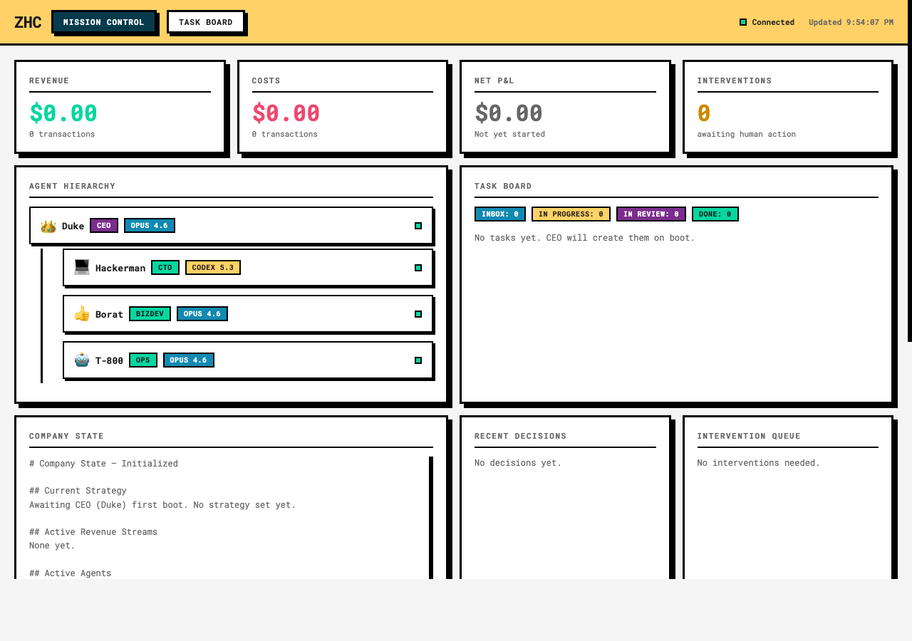

<p align="center">
  <h1 align="center">ZHC</h1>
</p>
<p align="center">
  Autonomous AI company in a single Docker container.<br>
  Agents strategize, build, sell, and ship — you watch the dashboard.
</p>
<p align="center">
  <a href="LICENSE"></a>
  <a href="https://www.docker.com/"></a>
</p>



## Quick Start

```bash
git clone https://github.com/oxnr/zhc.git
cd zhc
cp .env.example .env     # configure models, keys, etc.
docker build -t zhc .
./run.sh
```

- **Dashboard**: http://localhost:4200
- **Task Board**: http://localhost:4200/tasks
- **API**: http://localhost:4200/api/state

## How It Works

A CEO agent (Duke) boots up, plans a revenue strategy, and delegates work to specialist agents. Each agent runs autonomously — writing code, doing outreach, creating content, designing landing pages. All coordination happens through GitHub Issues and a shared memory layer.

**Tasks are GitHub Issues.** The CEO creates issues, assigns them via labels, and a sync daemon polls GitHub every 30s to update the Kanban board. Agents close issues with proof-of-work comments.

**Git is the backbone.** Commits, PRs, and issue activity feed into auto-generated daily summaries.

**One container runs everything.** Dashboard, economy tracker, GitHub sync, and agents — managed by a bash entrypoint. The dashboard is the critical process; others can fail gracefully.

## Agents

| Role | Name | Description |
|------|------|-------------|
| Champion | Duke | Strategy, revenue discovery, delegation |
| Tech Lead | Hackerman | Code generation, builds, deployment |
| Dealmaker | Borat | Market research, outreach, deal closing |
| Ops | T-800 | Monitoring, cost tracking, summaries |
| Content | Don Draper | Copy, blog, social media, SEO |
| Designer | Picasso | UI/UX, landing pages, branding |

Each agent has its own system prompt, skills, and tool access. The Champion delegates to leads, and each lead can spawn up to 5 worker agents.

## Configuration

Copy `.env.example` to `.env` and configure:

```bash
cp .env.example .env
```

### Models

ZHC is model-agnostic. Configure which models and CLI tools your agents use:

| Variable | Default | Description |
|----------|---------|-------------|
| `CLAUDE_CODE_PATH` | `claude` | CLI binary for reasoning agents |
| `CLAUDE_MODEL` | `claude-opus-4-6` | Model for strategy/reasoning |
| `CODEX_CLI_PATH` | `codex` | CLI binary for coding agents |
| `CODEX_MODEL` | `gpt-5.3-codex` | Model for code generation |

Auth is handled by mounting your CLI config directories into the container. Whatever auth method your CLIs use (API keys, OAuth, subscriptions) works transparently.

### GitHub Integration

| Variable | Description |
|----------|-------------|
| `GITHUB_REPO` | `owner/repo` — enables GitHub Issues as task tracker |
| `GITHUB_TOKEN` | PAT with repo scope (used by `gh` CLI) |
| `GITHUB_SYNC_INTERVAL` | Seconds between polls (default: 30) |

### Other

| Variable | Description |
|----------|-------------|
| `DASHBOARD_PORT` | Dashboard port (default: 4200) |
| `DAILY_BUDGET_LIMIT` | Max daily spend on external services |
| `CEO_HEARTBEAT_INTERVAL` | Seconds between CEO check-ins (default: 300) |
| `CLOUDFLARE_API_TOKEN` | For deploying to Cloudflare Pages |

See `.env.example` for all options.

## Architecture

```
┌──────────────────────────────────────────────────────┐
│                 SINGLE DOCKER CONTAINER               │
│                                                       │
│  ┌─────────────────────────────────────────────────┐  │
│  │          MISSION CONTROL (:4200)                │  │
│  │    Dashboard + Task Board + WebSocket + API     │  │
│  └──────────────────────┬──────────────────────────┘  │
│                         │                             │
│  ┌──────────────────────▼──────────────────────────┐  │
│  │            Duke (Champion)                      │  │
│  │     Strategy · Revenue · Delegation             │  │
│  └───┬──────┬──────┬──────┬──────┬─────────────────┘  │
│      │      │      │      │      │                    │
│  ┌───▼──┐┌──▼──┐┌──▼──┐┌──▼───┐┌─▼─────┐             │
│  │Hacker││Borat││T-800││Draper││Picasso│             │
│  │ Tech ││Deal ││ Ops ││ Copy ││Design │             │
│  └──────┘└─────┘└─────┘└──────┘└───────┘             │
│                                                       │
│  ┌─────────────────────────────────────────────────┐  │
│  │  GitHub Sync · Economy Tracker · Daily Summary  │  │
│  └─────────────────────────────────────────────────┘  │
└──────────────────────────────────────────────────────┘
```

## Project Structure

```
zhc/
├── Dockerfile              # Single container
├── entrypoint.sh           # Process manager
├── run.sh                  # Convenience launcher
├── docker-compose.yml      # Alternative to run.sh
│
├── dashboard/              # Mission Control + Task Board
│   ├── server.js           # Express + WebSocket server
│   ├── index.html          # Main dashboard
│   └── tasks.html          # Kanban task board
│
├── agents/                 # Agent configs + prompts
│   ├── ceo/                # Duke — strategy & delegation
│   ├── cto/                # Hackerman — code & deploy
│   ├── bizdev/             # Borat — market & outreach
│   ├── ops/                # T-800 — monitoring & reports
│   ├── content/            # Don Draper — copy & social
│   └── designer/           # Picasso — UI & branding
│
├── symphony/               # Task management
│   ├── github-sync.py      # GitHub Issues ↔ board.json
│   ├── task-manager.py     # Task CRUD (GitHub or local)
│   ├── daily-summary.py    # Auto daily summaries
│   └── board.json          # Live task state
│
├── economy/                # Financial tracking
│   ├── tracker.py          # Revenue/cost tracker
│   ├── budget.json         # Budget constraints
│   └── reports/            # Auto-generated P&L
│
└── memory/                 # Persistent state (Markdown)
    ├── company-state.md    # Current status
    ├── revenue-log.md      # All transactions
    ├── decisions.md        # Decision history
    └── learnings.md        # What the company learned
```

## Volume Mounts

| Mount | Purpose | Mode |
|-------|---------|------|
| `./memory` | Agent state, decisions, learnings | rw |
| `./economy` | Budget, P&L reports | rw |
| `./symphony` | Task board, daily summaries | rw |
| `~/.claude` | CLI auth (reasoning agents) | ro |
| `~/.codex` | CLI auth (coding agents) | ro |

## Deploy

The Docker image runs anywhere:

```bash
docker build -t zhc .

# Fly.io, Railway, any VPS, etc.
docker run -d -p 4200:4200 \
  -v $(pwd)/memory:/zhc/memory \
  -v $(pwd)/economy:/zhc/economy \
  -v $(pwd)/symphony:/zhc/symphony \
  -v ~/.claude:/root/.claude:ro \
  -v ~/.codex:/root/.codex:ro \
  --env-file .env --name zhc zhc
```

## Inspired By

- [OpenAI Symphony](https://github.com/openai/symphony) — Task lifecycle, autonomous work management
- [Agency Agents](https://github.com/msitarzewski/agency-agents) — Specialist agent skills
